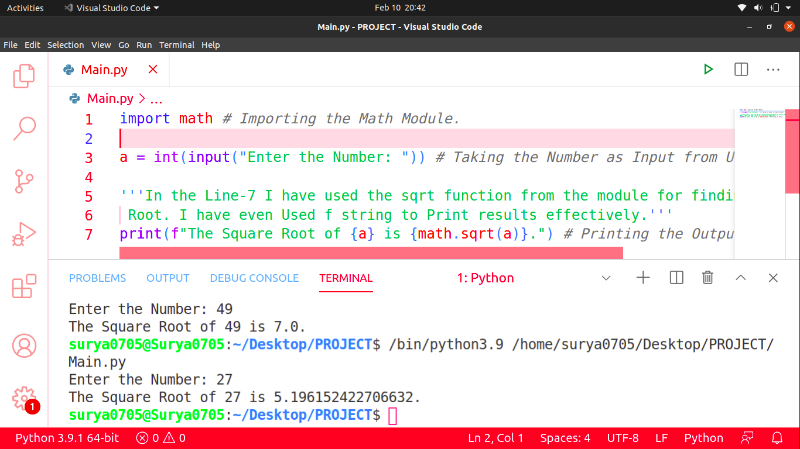

# Square_Root_Using_Python
This is a Python Program that Prints Square Root of a Number. It uses a built-in Module named math for this Purpose which would be Present in your System as well if you have installed Python Correctly. Below is the Screenshot of My Program:

Hope that you liked it!
